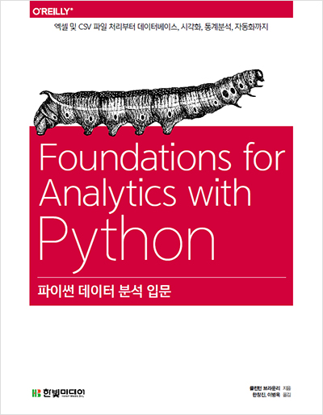

# 파이썬 데이터 분석 입문

파이썬 데이터 분석 입문(클린턴 브라운리 지음, 한창진 , 이병욱 옮김)

초심자를 대상으로 작성된 책이어서, 금방 넘겨 볼 수 있었다. 튜토리얼로 쓰려고 하는 [Python 101](https://code.taegon.kr/python101)에서 목차를 참고할 수 있을 것 같아서 정리한다.

## 목차

* 파이썬 기초
* CSV 파일
* 엑셀파일
* 데이터베이스
* 응용작업
* 데이터시각화
* 기술통계와 모델링
* 스크립트 자동 실행 예약
* 더 공부할 것들

## 파이썬 기초

* 코드 작성하는 법
* 코드 실행하는 법
* CLI에서 유용한 팁: history(up arrow), ctrl+c
* 파이썬 기본구성요소
  * 자료형과 간단한 문자열 함수
  * 정규식, 날짜: 이건 넘어가도 될 듯
  * 리스트: 인덱스, 분할, 병합, 복사, 추가, in과 not in, sort
  * 튜플
  * 딕셔너리
  * 제어문
  * 리스트 Comprehension (축약?)
  * 함수
  * 예외
* 텍스트 파일 읽고, 쓰기
  * glob를 이용하여, 다수 텍스트 파일 읽기
  * csv 읽고 쓰기
* print

## CSV 파일

파이썬과 pandas를 비교하고 있다.

* 파일읽기
* 파싱: csv 모듈을 이용하자
* csv 파일쓰기
* 특정행 필터하기
* 특정열 선택하기
* 연속된 행 선택하기
* 헤더 추가하기
* 여러개의 파일 다루기
* 평균 구하기

## 엑셀파일

아나콘다 배포판을 설치하였다면, xlrd 및 xlwt 패키지가 설치되어 있을 것이며, 운영체제에 상관없이 작동할 것이다.

엑셀파일 역시 pandas를 이용 가능하다.

csv 파일과 다르게 엑셀을 여러개의 sheet가 있다는 것과 행과 열을 선택한다는 점만 다르고, 작업은 대부분 유사하다.

## 데이터베이스

내장 모듈인 sqlite3를 이용하면 간단하게 이용가능하다.

MySQL를 쓰려면 mysqlclient 패키지가 설치되어야 한다.

## 응용작업

* 대량의 파일에서 원하는 집합 찾기
* 텍스트파일/csv 파일에서 카테고리별 통계치 계산하기

## 데이터 시각화

* matplotlib
  * 막대그래프
  * 히스토그램
  * 선 그래프
  * 산점도
  * 박스플롯
* pandas
* ggplot
* seaborn

## 기술통계와 모델링

마지막 장에서는 와인 품질 데이터셋과 고객 이탈 데이터셋을 이용하여 기술통계에 대해서 살펴본다.

기술통게는 pandas 데이터 프레임으로 읽은 후, `pd.describe()`를 실행하면 요약 통계를 보여준다.

그룹화, 히스토그램, t검정, 상관관계, 선형회귀 등은 statsmodels 패키지를 이용하여 쉽게 적용할 수 있다.

## 스크립트 자동 실행 예약하기

유닉스 계열(맥 포함)에서는 크론탭(crontab)을 이용하면 된다. 윈도우에서는 작업 스케줄러를 이용하면 된다.

## 더 공부할 것

### 표준 라이브러리

* collections
* random
* statistics
* itertools
* operator
* 내장함수: enumerate, filter, zip

### 파이썬 패키지 인덱스(PyPI) 추가 모듈

* NumPy
* SciPy: 과학/통계 분포, 함수, 검정 등
* scikit-learn: 회귀, 분류, 군집화 등 통계적 머신러닝 모형
* 기타 추가 패키지
  * xarray: 팬더스와 유사한 다차원 배열 분석
  * SKLL: 사이킷런 연산 실행용 CLI 유틸리티
  * NetworkX: 네트워크 분석 함수
  * PyMC: 베이즈 확률이나 마코브 연쇄 몬테카를로 등을 구현
  * NLTK: 자연어 분석, 한글은 KoNLPy
  * Cython: 파이썬에서 C코드 호율용

### 자료구조

* 스택
* 큐
* 그래프
* 트리
